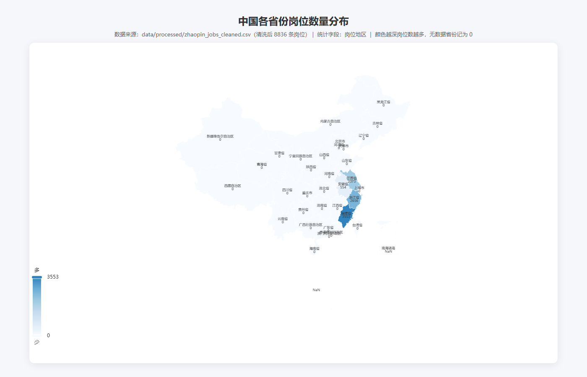
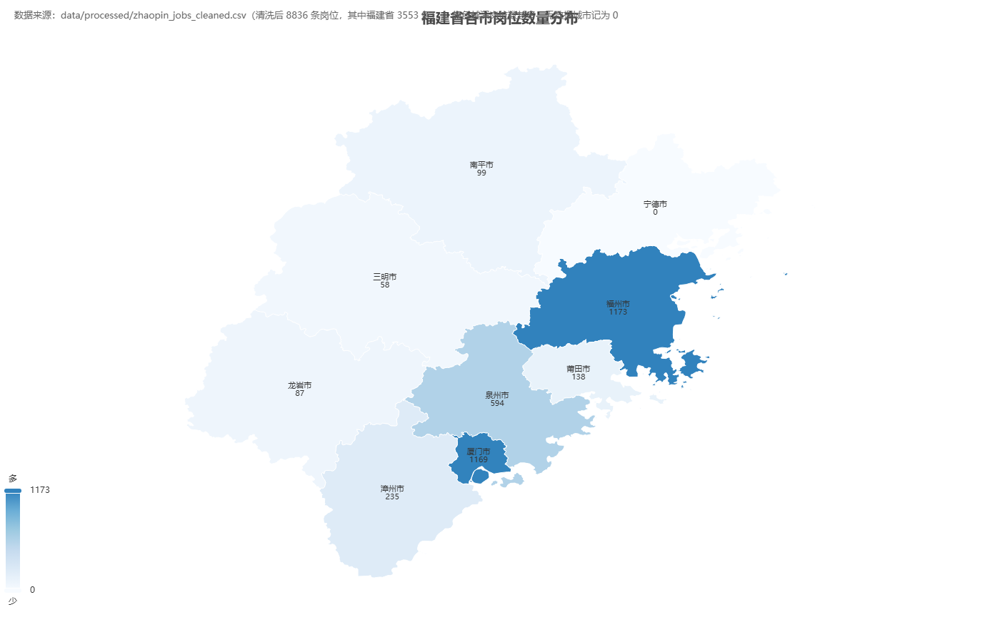

# 中期汇报一 · PPT 大纲与配图清单

> 汇报主题：**数据看板 + 评分模型演示**
> 评审目标对齐：① 数据量 ≥1 万条 ② 清洗规范 ③ 可视化有洞察（能解释图表含义） ④ 模型可解释
> 交付物：PPT（.pptx）｜ 建议页数：18 页 ｜ 汇报时长：8~10 分钟

---

## 〇、评审目标 → 页面映射（先想清楚，再排页面）

| 评审点 | 用哪些页证明 | 关键数字/材料 |
|--------|-------------|--------------|
| 数据量 ≥1万条 | P5 数据采集 | 原始 **12355 条** 岗位 + 500 份简历 + 153872 条配对样本 |
| 清洗规范 | P6 数据清洗 | 清洗规则表 + 12355→8836 的处理闭环 + 《数据预处理文档》 |
| 可视化有洞察 | P7~P10 数据看板 | 8 张图，每张配"现象→含义→启发" |
| 模型可解释 | P13~P15 评分模型 | 4 门槛规则 + 12 维特征含义 + Logistic 权重/特征重要性 |

---

## 一、PPT 逐页大纲

### P1 封面
- 标题：岗位-简历人岗匹配推荐系统
- 副标题：中期汇报一 · 数据看板与评分模型演示
- 团队 / 成员、课程（行业大数据分析实践）、日期（2026-09-11）
- 配图：无需图，用项目 logo 或纯排版

### P2 汇报框架（目录）
- 四段式：数据采集 → 数据清洗 → 数据看板（可视化）→ 评分模型（可解释）
- 直接点题评审四个要求分别在哪一段体现
- 配图：无（纯文字目录，或简单四宫格）

### P3 项目背景与业务问题（30 秒带过）
- 一句话：爬真实岗位数据 → 用户提交简历 → 系统给「匹配评分 → 岗位推荐 → 聚类画像 → 智能问答」完整链路
- 四个业务问题：①质量评分 ②人岗匹配 ③岗位聚类 ④大模型应用（本期只讲 ①②）
- 配图：无

### P4 技术路线总览（**需补图 B1**）
- 展示 pipeline：数据采集(51job/智联爬虫) → 清洗(jieba分词+结构化) → 可视化(ECharts) → 评分模型(Logistic/SVM/RF/XGBoost)
- 配图：**B1 技术路线流程图**（PPT 原生形状或 draw.io 画）

### P5 数据采集：数据量展示（**重点：证明 ≥1万条**）
- 原始数据 **12355 条**岗位（16 字段）、覆盖 19 城市 × 8 关键词
- 另附：500 份模拟简历、153872 条配对样本（为评分模型服务）
- 关键字段截图：岗位名称/薪资/地区/经验/学历/技能标签/职位描述/公司名称
- 配图：**B2 采集覆盖图**（可选，城市×关键词热度矩阵，或采集量分布条形图）

### P6 数据清洗规范（**重点：证明"清洗规范"**）
- 清洗五步：缺失值 → 去重 → 类型标准化（专科→大专、薪资折算月薪）→ 字段结构化 → 异常检测（只记录不改动）
- 展示 12355 → **8836** 的闭环：删了多少、改了什么、为什么
- 引用《数据预处理文档》作为规范依据
- 配图：**B3 清洗前后对比图**（原始 vs 清洗后 的行数/字段/异常数对比，可做柱状对比图）

### P7 数据看板 · 地域分布（图7+图8）
- 中国地图：岗位集中在福建(40.21%)/浙江(30.06%)/江苏(23.46%)/安徽(6.27%)，其余为 0（采样边界，需诚实说明）
- 福建地图：福州 33.01% + 厦门 32.9% 双核占 66%，沿海五市占 93%
- **洞察一句话**：岗位高度集聚于华东 + 福厦泉沿海带，系统需声明地域边界
- 配图：已有 **图7 中国地图 + 图8 福建地图**（PNG 已生成）

### P8 数据看板 · 薪资与经验（图1 + 图5）
- 图1：薪资峰值 5-8千(42.81%)，5千~1.5万占 86%，高薪稀缺
- 图5：经验→薪资单调上升，应届 5463 → 10年以上 12579；苏州最高、福州垫底
- **洞察一句话**：经验是薪资第一驱动力，应届→1-3年与 5-10→10年以上两个跳档涨幅最大
- 配图：已有 **图1 薪资分布 + 图5 经验-薪资折线**

### P9 数据看板 · 学历与技能（图4 + 图3）
- 图4：本科 55.75% + 大专 34.25% = 90%，本/专科是绝对主体
- 图3：词云 QE/QC/QA 质量类 + Python/Java 主流，且混入行业/福利词（需清洗）
- **洞察一句话**：学历门槛本/专科为主、与经验联动；技能标签字段语义混杂，任务6需先分层清洗
- 配图：已有 **图4 学历饼图 + 图3 技能词云**

### P10 数据看板 · 经验结构与招聘企业（图2 + 图6）
- 图2：经验越资深本科占比越高（1-3年 48.55% → 10年以上 68.38%）
- 图6：企业长尾（Top1 仅 0.97%），IT 外包 + 制造业龙头并存，福建本地 IT 活跃
- **洞察一句话**：学历门槛随经验升高，招聘需求分散无垄断雇主
- 配图：已有 **图2 经验-学历堆叠 + 图6 企业 TOP 榜**

### P11 可视化洞察小结（收束，呼应评审"能解释图表含义"）
- 一张表把 8 张图的"现象 → 业务含义 → 对系统启发"浓缩成 3 列
- 强调：每张图都能讲出"这不是画图，是发现了什么"
- 配图：无（纯表格，或把 8 张缩略图拼成 dashboard 一屏）

### P12 评分模型 · 标签构造（进入模型部分）
- 正样本 = 同时满足 4 门槛：距离≤300km ∧ 学历≥要求 ∧ 经验满足区间 ∧ 技能命中≥1
- 负样本 = 随机错位 + 至少2维度不满足；正负比 1:1.2，共 **153872 条**
- 配图：**B4 标签规则示意图**（4 门槛用 4 个框 + 交集示意，PPT 形状画）

### P13 评分模型 · 特征工程（**可解释性的根基**）
- 12 维特征，全部有业务含义，分 4 类：
  - 基础属性：城市匹配度/学历匹配度/经验是否满足/经验差值(+归一化)
  - 技能匹配：技能Jaccard/核心技能命中率/技能覆盖度
  - 文本语义：岗位-经历相似度/岗位-意向相似度(TF-IDF余弦)
  - 附加：专业匹配度/证书命中数
- 配图：**B5 单特征 AUC 条形图**（12 特征区分力排序，技能类 AUC≈0.94 最强，证书≈0.50 弱特征）

### P14 评分模型 · 训练与评估（4 模型对比）
- Logistic（基线）→ SVM → 随机森林 → XGBoost（上线）
- **严格划分防泄漏**：简历+岗位均不重叠（这页要讲"为什么指标可信"）
- 指标：严格划分下随机森林/XGBoost Acc 1.0、AUC 1.0，Logistic AUC 0.998
- 配图：已有 **图9 模型对比_指标与耗时.png + 图10 ROC曲线.png + 图11 混淆矩阵.png**

### P15 评分模型 · 可解释性（**评审重点，单独一页**）
- 三个层次讲"模型为什么可解释"：
  1. **特征层**：12 维特征都是人读得懂的匹配维度（不是黑箱向量）
  2. **规则层**：标签由 4 条业务规则生成，阈值型特征切分贴合业务逻辑
  3. **模型层**：Logistic 给出每维权重方向（正/负贡献）+ 树模型特征重要性排序
- 配图：已有 **图12 模型对比_特征重要性.png**
- 可选加分：SHAP 图（如果要做，用 XGBoost + shap 库生成，标注为"可选"）

### P16 评分模型 · 演示流程（Demo 串讲）
- 演示：粘贴/上传简历 → 抽取 12 维特征 → predict_proba 得匹配概率 → ×100 映射为 0~100 分 → Top-N 排序推荐
- 用 `models/xgboost_scoring_model.json`（已上线模型）+ `model_metadata.json`
- 配图：**B6 Demo 流程/界面截图**（简历输入→打分→推荐列表 三屏截图，或用流程框）

### P17 当前成果小结 + M1 达成情况
- 对照 M1 里程碑（9/11）逐项打勾：≥1万条 ✓、清洗规范 ✓、≥6张图 ✓、评分模型可解释 ✓
- 一张"成果清单"表

### P18 下一步计划（第2、3周）
- 任务6 人岗匹配（TF-IDF+余弦+加权公式）
- 任务7/8 聚类 + 多模型对比
- 任务10 RAG + Agent
- 任务11/12 FastAPI 前端 + Docker 部署 + 测试
- 配图：无（时间轴即可）

### （可选）P19 Q&A / 致谢
- 备用页：数据口径说明、诚实声明局限（答辩被问"全国地图为什么大部分空"时翻到这页）

---

## 二、需要什么图（分两类）

### A 类：已有图，直接插入 PPT（无需新做）

| 编号 | 图 | 文件路径 | 用在哪页 |
|------|-----|---------|---------|
| 图1 | 岗位薪资水平对比（柱状图） | `reports/figures/01_岗位薪资水平对比_柱状图.png` | P8 |
| 图2 | 经验要求结构分布（堆叠柱状图） | `reports/figures/02_经验要求结构分布_堆叠柱状图.png` | P10 |
| 图3 | 核心技能需求热度（词云） | `reports/figures/03_核心技能需求热度_词云.png` | P9 |
| 图4 | 学历要求门槛分析（饼图） | `reports/figures/04_学历要求门槛分析_饼状图.png` | P9 |
| 图5 | 经验-薪资增长曲线（折线） | `reports/figures/05_经验薪资增长曲线_多折线图.png` | P8 |
| 图6 | 招聘活跃企业 TOP 榜（横向柱状） | `reports/figures/06_招聘活跃企业TOP榜_横向柱状图.png` | P10 |
| 图7 | 中国各省岗位数量分布 | `reports/figures/中国地图_岗位数量分布.png` | P7 |
| 图8 | 福建省各市岗位数量分布 | `reports/figures/福建省地图_岗位数量分布.png` | P7 |
| 图9 | 模型对比·指标与耗时 | `reports/figures/模型对比_指标与耗时.png` | P14 |
| 图10 | 模型对比·ROC 曲线 | `reports/figures/模型对比_ROC曲线.png` | P14 |
| 图11 | 模型对比·混淆矩阵 | `reports/figures/模型对比_混淆矩阵.png` | P14 |
| 图12 | 模型对比·特征重要性 | `reports/figures/模型对比_特征重要性.png` | P15 |

> 图7/图8 已生成 PNG，直接插入 PPT 即可（源 HTML 保留在 reports/figures/ 供交互查看）。

### B 类：建议补充的图（PPT 专用，当前缺失，需新做）

| 编号 | 图 | 用途 | 怎么画 / 数据来源 |
|------|-----|------|------------------|
| B1 | 技术路线流程图 | P4 | PPT 原生形状或 draw.io：采集→清洗→可视化→模型 四段 pipeline |
| B2 | 数据采集覆盖图（可选） | P5 | 从 `zhaopin_jobs_full.csv` 统计"城市×关键词"采集量，画热力图/条形图 |
| B3 | 清洗前后对比图 | P6 | 从《数据预处理文档》提取 12355→8836 的删减量与异常数，画对比柱状图 |
| B4 | 标签规则示意图 | P12 | PPT 形状画 4 个门槛框 + 交集，标"正样本=4项全满足" |
| B5 | 单特征 AUC 条形图 | P13 | 数据在 `data/processed/匹配特征_说明.md` 第二节表，画 12 特征 AUC 排序条形图 |
| B6 | Demo 流程/界面截图 | P16 | 运行评分流程截图（简历→打分→推荐），或画三框流程图 |

---

## 三、答辩速查数字表（备用）

| 维度 | 关键数字 |
|------|---------|
| 原始岗位 | 12355 条（16 字段，19 城 × 8 关键词） |
| 清洗后岗位 | 8836 条 |
| 简历 | 500 份（模拟脱敏） |
| 配对样本 | 153872 条（正 69942 / 负 83930，1:1.2） |
| 特征维度 | 12 维（4 类，全部有业务含义） |
| 模型 | Logistic / SVM / 随机森林 / XGBoost |
| 严格划分最优 | 随机森林 & XGBoost：Acc=1.0、AUC=1.0；Logistic：AUC=0.9983 |
| 薪资峰值 | 5-8千（42.81%）；应届 5463 → 10年以上 12579 元/月 |
| 学历主体 | 本科 55.75% + 大专 34.25% = 90% |
| 地域 | 福建 40.21% 领先；福厦双核占福建 66% |

---

## 四、交付建议

1. **先做 B 类图**（尤其 B1 技术路线、B4 标签规则、B5 单特征 AUC、B6 Demo 流程），这些是"数据看板+评分模型"叙事的骨架，缺了 PPT 会空。
2. **图7/图8 的 PNG 已生成**（`reports/figures/`），直接插入即可，无需再截图。
3. **P15 可解释性务必给足时间**，这是评审点名的重点，不要一页带过。
4. 生成 .pptx 可用 `python-pptx`（requirements 里可补），或直接在 WPS/Office 里按本大纲排版。
