# 可视化分析报告 —— 任务4 多维度可视化分析

| 项目 | 内容 |
|------|------|
| 课程 | 行业大数据分析实践（23大数据班） |
| 对应任务 | 任务4 多维度可视化分析与评分模型搭建（2026-09-10） |
| 硬性要求 | ≥6 张有业务含义的图，每张配文字洞察（能解释图中的含义） |
| 数据来源 | `data/processed/zhaopin_jobs_cleaned.csv`（8,836 条清洗后岗位，智联招聘采集） |
| 图表输出 | `reports/figures/`（每张图三件套：交互 HTML + 高清 PNG + 数据 CSV） |
| 图表数量 | **16 张**（9 张岗位分析图 + 2 张地域分布地图 + **5 张模型评估图**） |
| 状态 | ✅ 已完成 |
| 记录人 | 王俊淇 ｜ 版本 v1.2（2026-09-14，新增图12–图16 模型评估图，并更正 §四 关于技能维度的旧判断） |

---

## 一、数据与口径说明

- **样本**：8,836 条岗位（原始 12,355 条，清洗后；详见《数据预处理文档》）；
- **地域口径**：以 `岗位地区` 字段首个城市词为准（`城市(实测)` 列已删除）；
- **薪资口径**：`岗位薪资` 正则解析为月薪（区间取中值、日薪×21.75、时薪×8×21.75），可解析率 **99.97%**（8,833/8,836）；
- **技能口径**：`技能标签` ∪ `职位描述`分词中命中简历技能池（74 项技术词）的技能词；词云已剔除福利待遇、行业/企业/平台等非技能标签（434 种，明细见 `03_..._已剔除的非技能词.csv`）；
- **岗位大类口径**：6,037 种原始岗位名称按 18 条关键词规则归并为 18 个岗位大类，未命中的归入"其他"（10.4%）；
- **工具**：业务图用 ECharts 5.4.3（交互 HTML + 无头 Chrome 导出 PNG），模型评估图用 matplotlib；所有图均由脚本一键复现（`src/analysis/job_charts.py`、`src/analysis/map_job_distribution.py`）。

---

## 二、图表总览

> 📊 **配套数据看板**：`reports/数据看板.html`（双击即可打开）——把本报告 **11 张业务图 / 地图**汇总成一页，
> 每张图都配「数据结论 + 对系统的启示」，并附交互版（ECharts HTML）链接，答辩演示时可直接用。
> **5 张模型评估图（图12–图16）暂未收入看板**，请见 `docs/评分模型文档.md` 与 `reports/figures/12~16_*.png`。

| # | 图表 | 类型 | 图片文件 |
|---|------|------|---------|
| 1 | 岗位薪资水平对比（全部岗位分布） | 柱状图 | `01_岗位薪资水平对比_柱状图.png` |
| 2 | 经验要求结构分布（经验等级 × 学历构成） | 堆叠柱状图 | `02_经验要求结构分布_堆叠柱状图.png` |
| 3 | 核心技能需求热度 | 词云 | `03_核心技能需求热度_词云.png` |
| 4 | 学历要求门槛分析 | 饼状图 | `04_学历要求门槛分析_饼状图.png` |
| 5 | 经验-薪资增长曲线（6 个主要城市） | 多折线图 | `05_经验薪资增长曲线_多折线图.png` |
| 6 | 招聘活跃企业 TOP20 | 横向柱状图 | `06_招聘活跃企业TOP榜_横向柱状图.png` |
| 7 | 岗位分布（岗位大类 + 高频岗位） | 双面板横向柱状图 | `07_岗位分布_横向柱状图.png` |
| 8 | 中国各省岗位数量分布 | 地图（分级设色） | `中国地图_岗位数量分布.png` |
| 9 | 福建省各市岗位数量分布 | 地图（分级设色） | `福建省地图_岗位数量分布.png` |
| 10 | 回复积极企业 TOP20（基于今日回复数） | 横向柱状图 | `10_回复积极企业TOP20_横向柱状图.png` |
| 11 | 全部岗位薪资统计（直方图 + 累计分布 + 分位数） | 组合图（柱 + 折线 + 横向柱） | `11_薪资统计_直方图与分位数.png` |
| 12 | 模型指标对比（2 口径 × 2 任务 × 各对照实验） | 分组柱状图（4 面板） | `12_模型对比_柱状图.png` |
| 13 | 预测值 vs 真实值（纯净标签 / 噪声标签） | 密度散点图（hexbin，2 面板） | `13_预测vs真实_散点图.png` |
| 14 | 残差分布（4 个回归模型） | 直方图（对数纵轴） | `14_残差分布_直方图.png` |
| 15 | 特征重要性 Top15（XGBoost 回归） | 横向柱状图 | `15_特征重要性Top15_横向柱状图.png` |
| 16 | 分类 PR 曲线（4 个分类模型） | 折线图 | `16_分类PR曲线_折线图.png` |

---

## 三、逐图分析

### 图1 岗位薪资水平对比（柱状图）

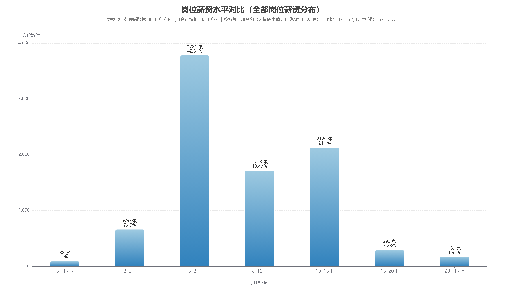

**① 看到了什么现象**
8,833 条可解析薪资中，**5-8 千占 42.81%（3,781 条）** 是最大档；8-10 千 19.43%、10-15 千 24.10%（两档合计 43.5%）；3 千以下仅 1.00%，15 千以上合计 5.19%。整体**平均 8,392 元/月、中位数 7,671 元/月**（均值高于中位数 → 分布右偏，被少数高薪岗位拉高）。

**② 可能的业务含义**
本批岗位以中低薪技术/职能岗为主，薪酬结构是"中部集中 + 右侧长尾"；高薪岗位样本很少，说明采集范围内高端岗位占比低。

**③ 对匹配/推荐系统的启发**
- 薪资宜作**分层展示**（`<8千` / `8-15千` / `15千以上`），避免用一个平均分掩盖结构差异；
- 任务6 的薪资匹配维度建议用**区间重叠度**而非精确相等（如"简历期望 8-10 千 vs 岗位 6-8 千"应给部分分）；
- 薪资不宜作硬门槛：中位数 7,671 元说明大量岗位薪资接近，用它筛人会误杀候选。

---

### 图2 经验要求结构分布（堆叠柱状图）

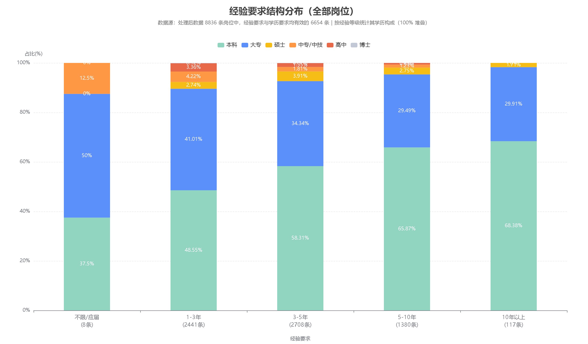

**① 看到了什么现象**
有效样本 6,654 条中：**3-5 年 2,708 条、1-3 年 2,441 条**（合计 77.4%），5-10 年 1,380 条，10 年以上仅 117 条，"不限/应届"仅 8 条（该等级样本极少，读图时以柱上标注的样本量为准）。
学历构成随经验等级升高明显"本科化"：1-3 年 本科 48.55% → 3-5 年 58.31% → 5-10 年 **65.87%** → 10 年以上 **68.38%**；同期大专从 41.01% 降到 29.91%。

**② 可能的业务含义**
市场主力需求是 **1-5 年经验**的中坚岗位；经验要求越高，学历门槛同步抬升，两者是**互补门槛**而非替代关系——高经验岗位更偏好本科及以上。

**③ 对匹配/推荐系统的启发**
- 经验匹配不能只做二值判断，建议按**等级差值给分**（刚好满足 = 满分，超出 1 档 = 略降，不足 1 档 = 大幅降）；
- 对"5 年以上经验"岗位，若简历学历为大专，匹配分应适度下调（数据证明这类岗位本科占比接近 70%）；
- 系统可按经验等级做**候选分层召回**：应届/初级 → 1-3 年岗；3 年以上 → 3-5 年岗。

---

### 图3 核心技能需求热度（词云）


**① 看到了什么现象**
剔除 434 种非技能标签后保留 **4,327 个技能词**，Top15：**QE 390、Python 349、QC 327、Java 318、QA 280、C++ 270、MySQL 228、Spring 224、JavaScript 212、系统运维 164、人工智能 160、C# 155、C语言 138、功能测试 137、测试 108**。

**② 可能的业务含义**
需求集中在两条主线：**① 软件开发栈**（Python/Java/C++/C#/JavaScript/MySQL/Spring + 运维/云计算）；**② 质量管理与检验**（QE/QC/QA/功能测试/来料检验 IQC/制程检验 IPQC/质量管理）。这与图7 的岗位结构互为印证，说明本批数据是"制造业 + IT"混合产业结构。

**③ 对匹配/推荐系统的启发**
- 技能是**区分力最强**的维度（任务5 实测：技能 Jaccard / 核心技能命中率单特征 AUC 0.94~0.95，远高于学历 0.56、证书 0.50）；
- 建议任务6 直接用本图 Top-N 技术词构建"核心技能词典"，简历与岗位都映射到同一词典后做加权余弦；
- **QE/QC/QA/CQE 属于岗位职能缩写而非具体技术技能**，建议在匹配时单列（作为岗位类型信号），不要混进"技能命中数"（否则质量岗会被高估）。

---

### 图4 学历要求门槛分析（饼状图）

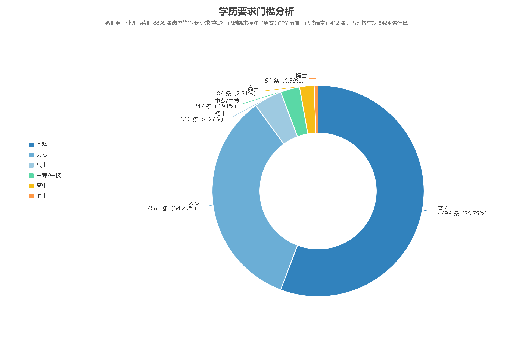

**① 看到了什么现象**
有效样本 8,424 条（已剔除 412 条学历未标注）：**本科 55.75%、大专 34.25%**，二者合计 **90.0%**；硕士 4.27%、中专/中技 2.93%、高中 2.21%、博士 0.59%（硕士及以上合计仅 4.86%）。

**② 可能的业务含义**
学历门槛以**本专科为主体**，研究生门槛岗位不足 5%，整体门槛不高但分层清晰——本科是"通用入场券"，大专仍有三分之一以上的岗位机会。

**③ 对匹配/推荐系统的启发**
- 学历构成第三条硬筛选线（继地域、经验之后）：**大专简历可覆盖 42.2% 的岗位**（高中/中专/大专/不限学历门槛），本科可覆盖 95.4%；
- 匹配系统应对"学历超出要求"（如本科投大专岗）**不扣分**，但要避免把"硕士要求"岗位推给本科简历（当前数据里这类岗位 410 个，模型学不到正样本）；
- 建议在推荐结果里显示"学历门槛：满足/超出"标签，提升可解释性。

---

### 图5 经验-薪资增长曲线（多折线图）

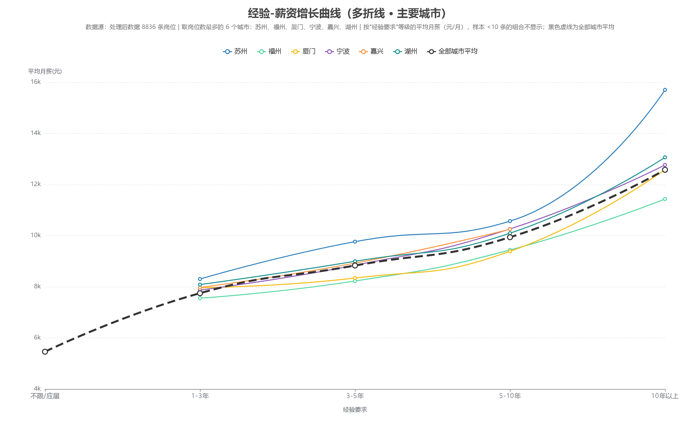

**① 看到了什么现象**
全部城市平均：**1-3 年 7,752 → 3-5 年 8,834 → 5-10 年 9,941 → 10 年以上 12,579 元/月**，从 1-3 年到 10 年以上累计 **+62%**。苏州全程最高（1-3 年 8,304 → 10 年以上 **15,705**），福州起点最低（1-3 年 7,558）；宁波、湖州、厦门、嘉兴居中（湖州 10 年以上 13,065、宁波 12,768、厦门 12,586、福州 11,436）。

**② 可能的业务含义**
经验是薪资的**核心解释变量**，且溢价非线性——5-10 年是加速段；同经验档下城市差异约 700~1,400 元，长三角（苏州）显著高于福建各市。

**③ 对匹配/推荐系统的启发**
- 经验可作为评分模型的**强特征**，并用于"薪资预期"推导：给简历一个"经验档 × 城市"的参考薪资区间；
- 提示推荐系统做**期望薪资校验**：若简历期望明显高于同经验档均值（如应届期望 15 千），可在结果中提示"高于市场水平"；
- 跨城市推荐时可结合城市薪资差异做**期望值校正**（如从福州投苏州，同岗位薪资预期可上调约 10%）。

---

### 图6 招聘活跃企业 TOP 榜（横向柱状图）

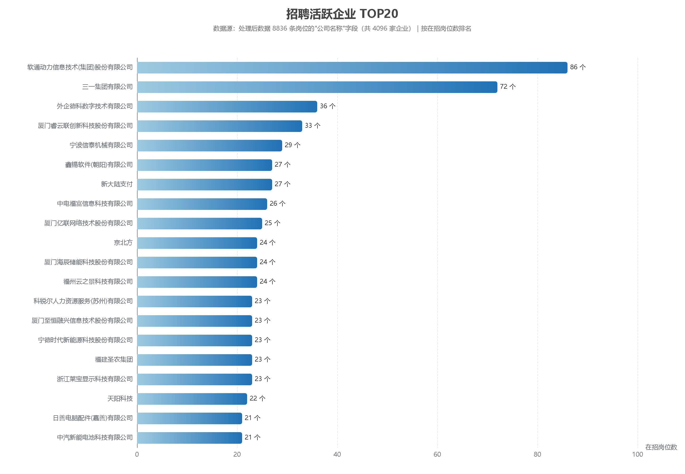

**① 看到了什么现象**
共 **4,096 家企业**，Top20 中最高为**软通动力 86 个岗位（占全部岗位 0.97%）**，其后三一集团 72、外企德科 36、厦门睿云联 33、宁波信泰 29、鑫锡软件 27、新大陆支付 27、中电福富 26、厦门亿联 25、京北方 24。

**② 可能的业务含义**
招聘集中度**极低**（头部企业不到 1%），市场呈典型长尾；头部以"软件外包/IT 服务 + 制造业龙头"为主，与图3、图7 的产业结构一致。

**③ 对匹配/推荐系统的启发**
- 推荐列表需要**公司维度去重**（同一公司最多展示 1~3 条），否则容易被少数活跃雇主刷屏；
- 头部企业可作为**重点岗位数据补充**对象，提高数据密度；
- 企业名称字段质量不错（无空值），可用于"公司"维度辅助特征。

---

### 图7 岗位分布（双面板横向柱状图）

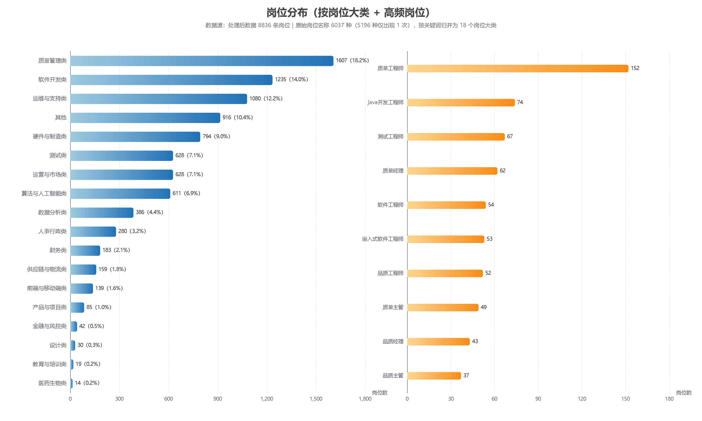

**① 看到了什么现象**
8,836 条岗位归并为 18 个大类：**质量管理类 1,607（18.19%）、软件开发类 1,235（13.98%）、运维与支持类 1,080（12.22%）**居前三，其后硬件与制造 794、测试 628、运营与市场 628、算法与人工智能 611、数据分析 386；"其他"（长尾零散岗位名）916 条占 10.37%。
具体岗位 Top：质量工程师 152、测试工程师 67、质量经理 62、软件工程师 54、嵌入式软件工程师 53、品质工程师 52、运维工程师 36。

**② 可能的业务含义**
本批岗位的需求结构是"**制造业质量/生产 + IT 开发/测试/运维**"双主线；岗位名称极度分散（6,037 种，其中 5,196 种只出现 1 次），说明直接按职位名统计/建模不可行。

**③ 对匹配/推荐系统的启发**
- **聚类（任务7）可直接借用本图的 18 个岗位大类作为簇的业务命名依据**，保证簇名可读；
- 匹配时先按"简历期望岗位 → 岗位大类"做**粗筛**，可把候选集从 8,836 压到千级，再在同大类内用评分模型精排，兼顾效果与性能；
- "其他"类占 10.4%，提示岗位名称归一化规则仍有优化空间（可作为后续改进点）。

---

### 图8 中国各省岗位数量分布（地图）


**① 看到了什么现象**
有效岗位仅分布在 4 个省级区域：**福建省 3,553（40.21%）、浙江省 2,656（30.06%）、江苏省 2,073（23.46%）、安徽省 554（6.27%）**，其余 30 个省级区域为 0（图上为最浅色）。

**② 可能的业务含义**
数据覆盖范围 = 采集策略的直接投影：以福建为核心、长三角为补充；这也解释了为什么匹配模型的"300km 距离门槛"会把广东、江西等地的简历全部排除出正样本。

**③ 对匹配/推荐系统的启发**
- 训练与推荐都应**限定在四省范围内**，对范围外城市必须显式提示"暂无岗位数据"，避免给出空推荐或误匹配；
- 后续若要扩大覆盖，只需增加城市坐标并重跑采集，模型与流水线无需改动（城市坐标表 `data/external/城市坐标.csv` 已结构化）。**注（2026-09-14）**：该表只覆盖旧版 19 个简历城市 + 16 个岗位城市；简历数据扩充到 32 城后有 16 个新城市未登记，任务5 建模所用 35 城经纬度暂内嵌在 `src/models/scoring/build_labels.py`（重叠城市坐标与外部表一致，差异 ≤0.02°），统一坐标源需重跑任务5 步骤1–4，详见《评分模型文档》§8.5。

---

### 图9 福建省各市岗位数量分布（地图）


**① 看到了什么现象**
**福州 1,173（33.01%）与厦门 1,169（32.90%）双核**，合计接近全省 2/3；泉州 594（16.72%）、漳州 235、莆田 138、南平 99、龙岩 87、三明 58，宁德为 0。

**② 可能的业务含义**
省内岗位高度集中在福厦双核，与福建的人才流动和产业分布一致；山区市（南平/龙岩/三明）岗位稀少，跨市求职是常态。

**③ 对匹配/推荐系统的启发**
- 福建简历的推荐池应**优先从福州、厦门召回**（300km 内两市岗位密度最高）；
- **距离应作为加权项而非仅二值门槛**：同城 > 邻近市（如厦门↔漳州）> 跨省，用于排序微调；
- 宁德等"有求职者但无岗位"的城市，应在系统中给出"周边城市推荐"的兜底策略。

---

### 图10 回复积极企业 TOP20（横向柱状图）

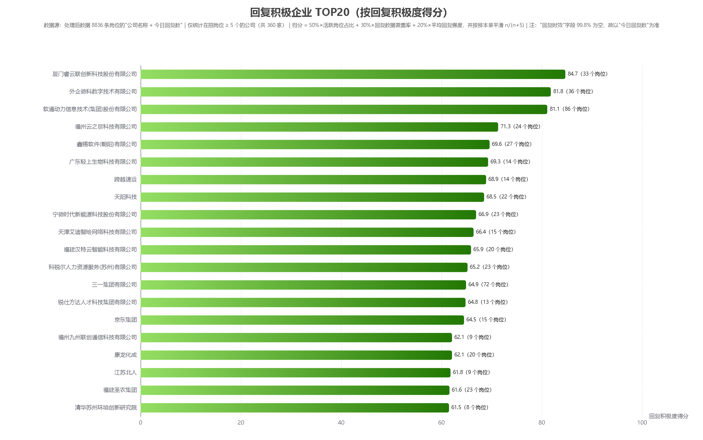

**① 看到了什么现象**
先看数据可用性：`今日回复数` 非空 **4,624/8,836（52.3%）**，而 `回复时效` 非空仅 **15/8,836（0.17%）**——因此"回复积极度"以 `今日回复数` 为准。
在**在招岗位 ≥5 个**的 360 家公司中排名（得分 = 50%×活跃岗位占比 + 30%×回复数据覆盖率 + 20%×平均回复强度，并按样本量平滑 n/(n+5)）：

| 排名 | 公司 | 岗位数 | 覆盖率 | 活跃岗位占比 | 平均今日回复 | 得分 |
|---|---|---|---|---|---|---|
| 1 | 厦门睿云联创新科技 | 33 | 100% | 100% | 43.9 | **84.7** |
| 2 | 外企德科数字技术 | 36 | 88.9% | 96.9% | 45.1 | 81.8 |
| 3 | 软通动力信息技术(集团) | 86 | 82.6% | 88.7% | 41.8 | 81.1 |
| 4 | 福州云之景科技 | 24 | 83.3% | 100% | 28.0 | 71.3 |
| 5 | 鑫锡软件(朝阳) | 27 | 88.9% | 83.3% | 35.5 | 69.6 |
| 6 | 广东轻上生物科技 | 14 | 92.9% | 100% | 40.5 | 69.3 |
| 7 | 跨越速运 | 14 | 78.6% | 100% | 50.0 | 68.9 |
| 8 | 天阳科技 | 22 | 81.8% | 100% | 23.9 | 68.5 |
| 9 | 宁德时代新能源科技 | 23 | 82.6% | 89.5% | 29.9 | 66.9 |
| 10 | 天津艾迪智绘网络科技 | 15 | 93.3% | 100% | 26.4 | 66.4 |

对照组更能说明问题：岗位数同样很多的**厦门亿联（25 岗）与中电福富（26 岗）`今日回复数` 覆盖率为 0**，因此得分分别为 0 和 2.3——高分与低分不是"公司好坏"，而是**平台是否记录到回复行为**。

**② 可能的业务含义**
头部活跃雇主集中在"福建本地软件/互联网企业 + 大型人力外包（外企德科、软通动力）"，这类公司岗位量大、且平台侧回复数据完整；而部分大厂岗位虽多，却没有回复记录，属于"挂了岗但平台未记录响应"。

**③ 对匹配/推荐系统的启发**
- 可把"**雇主响应度**"作为推荐排序的软性加分项（求职者体验直接相关），但要**区分"无回复数据"与"回复少"**：47.7% 岗位缺该字段，系统应显示"暂无数据"，不能判为"不活跃"；
- QE/QC 类制造业岗位的回复数据质量普遍较好，可作为"活跃雇主"白名单来源；
- 采集侧建议后续优先补齐 `回复时效` 字段（当前几乎全空），它是"响应速度"最直接的证据。

---

### 图11 全部岗位薪资统计（直方图 + 累计分布 + 分位数）

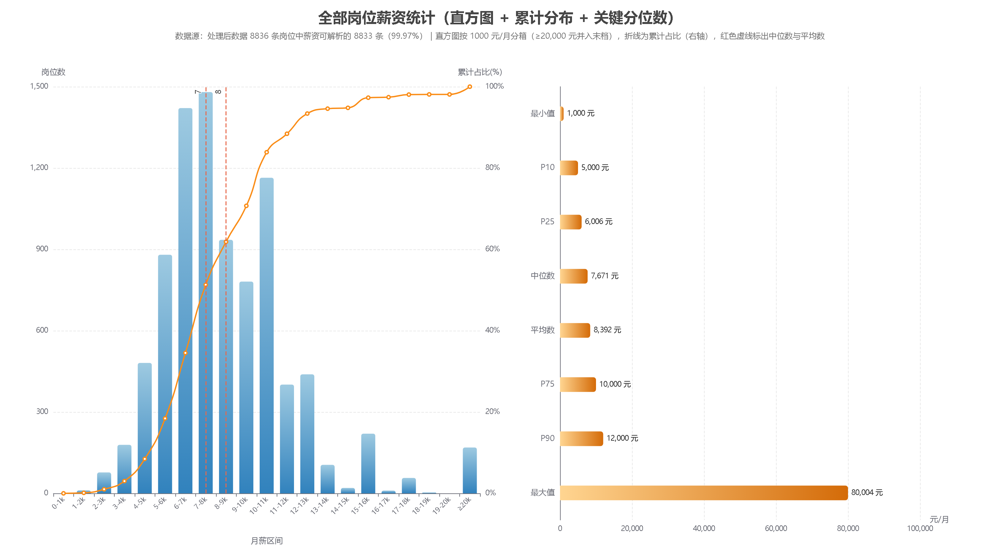

**① 看到了什么现象**
8,833 条可解析薪资的关键统计量：

| 统计量 | 最小值 | P10 | P25 | **中位数** | **平均数** | P75 | P90 | 最大值 |
|---|---|---|---|---|---|---|---|---|
| 月薪(元) | 1,000 | 5,000 | 6,006 | **7,671** | **8,392** | 10,000 | 12,000 | 80,004 |

直方图（1000 元/箱）显示峰值落在 **6-8 千**（6-7k 1,421 条 + 7-8k 1,480 条，合计 32.9%）；累计曲线读出：**50% 的岗位 ≤7,671 元、75% ≤10,000 元、90% ≤12,000 元**。平均数（8,392）高于中位数（7,671）**721 元（约 9.4%）**，说明分布**右偏**，被少量高薪岗位（最高 80,004 元/月）拉高。

**② 可能的业务含义**
"典型岗位"的薪资水平应看**中位数 7,671 元**；平均数偏高会让人误判市场行情。薪资结构是"中段集中 + 右侧长尾"：超过 12,000 元的岗位只占 10%。

**③ 对匹配/推荐系统的启发**
- 薪资匹配应以**中位数/分位数**为基准（如"岗位处于全市场 P75"），比用平均数更稳、更可解释；
- 给简历的"薪资预期"建议用 **P25-P75 区间**（6,006-10,000 元）表达，而不是单点数字；
- 对薪资 >P90（12,000 元）的岗位，样本仅 10%，做薪资预测/展示时要标注置信度较低；极端值（如 80,004 元）建议做截断或单独说明，避免影响模型。

---

### 图12–图16 模型评估图（任务5 评分模型）

> 标签口径、特征清单、完整指标与局限见 **《评分模型文档》**（`docs/评分模型文档.md`）。以下为逐图洞察。

#### 图12 模型指标对比

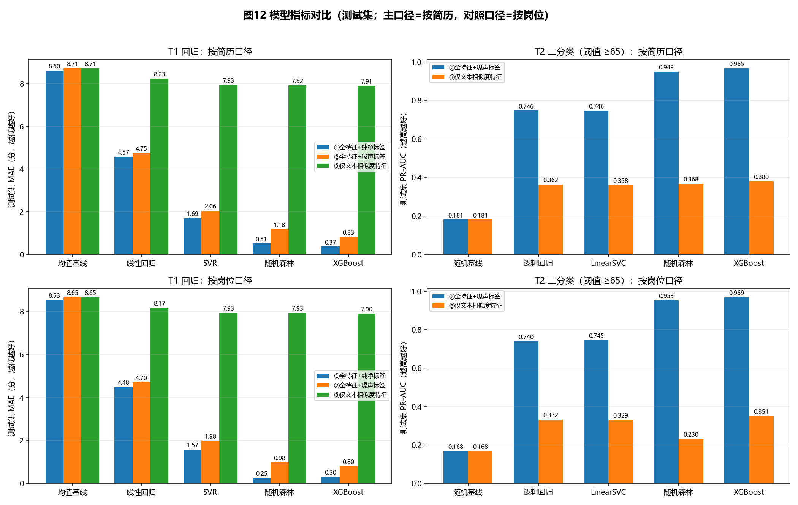

**① 现象**：4 个面板（2 口径 × 2 任务）中，**XGBoost 在每个面板都最优**：主口径 T1 噪声标签 MAE **0.827**（均值基线 8.711）、T2 PR-AUC **0.965**（随机基线 0.181）。线性基线在 T1 只有 4.755、T2 只有 0.746。

**② 业务含义**：规则里的阈值与比值关系**强非线性**——"经验差几年按比例扣分""距离分档""薪资比"这类关系用线性模型吃不下来，用树模型才拟合得上。

**③ 对系统的启发**：线上打分直接用 XGBoost；线性模型只适合做快速近似或可解释性对照。

#### 图13 预测值 vs 真实值

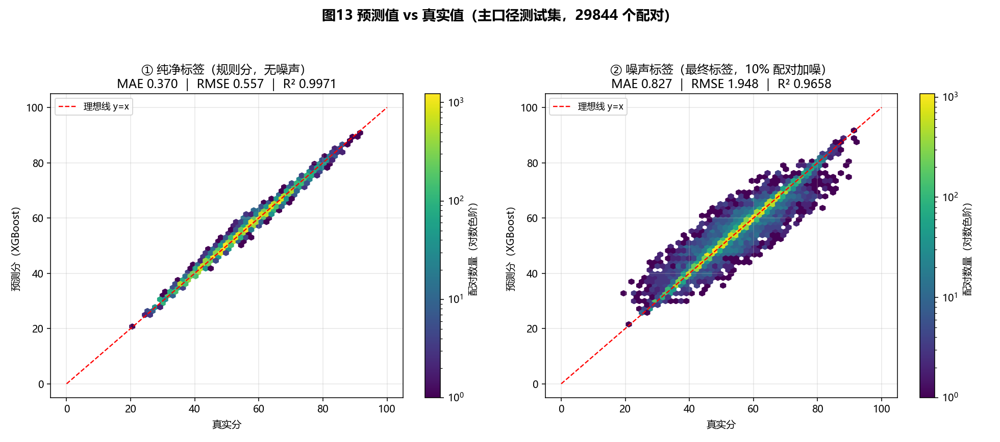

**① 现象**：左图（纯净标签）点几乎贴着 y=x（MAE 0.370、R² 0.997）；右图（噪声标签）在带内散开（MAE 0.827）。

**② 业务含义**：两图之差 = 人为加入的标签噪声。左图证明**特征已经足够还原规则**，右图证明**模型已打到噪声下限**。

**③ 对系统的启发**：不要指望继续调参把 MAE 压到 0.4 以下——那 0.48 分是标签本身的噪声，不是模型能力问题。

#### 图14 残差分布

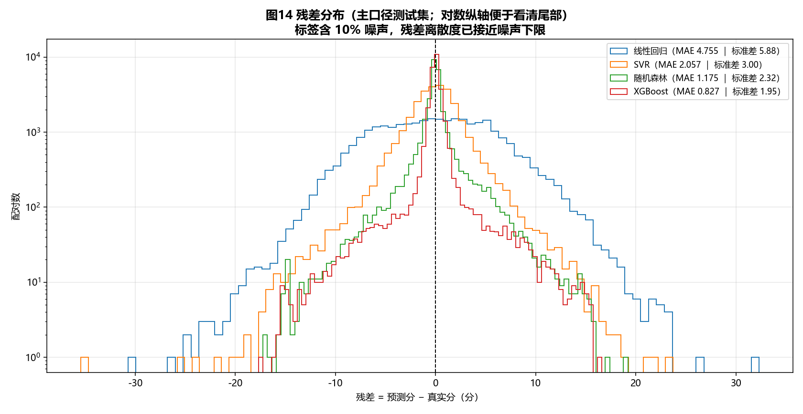

**① 现象**：XGBoost 残差集中在 ±1 分内，随机森林 ±3 分，SVR 与线性回归的尾部拖到 ±10 分以上；纵轴取对数后能看清长尾。

**② 业务含义**：误差大的模型把"55 分"和"68 分"混在一起——而 65 分正是匹配/不匹配的判定线，**残差大的模型在阈值附近误判率显著更高**。

**③ 对系统的启发**：推荐列表排序对残差敏感（NDCG@10：XGBoost 0.867 vs 线性 0.568），选模型要看排序指标，不能只看 MAE。

#### 图15 特征重要性 Top15

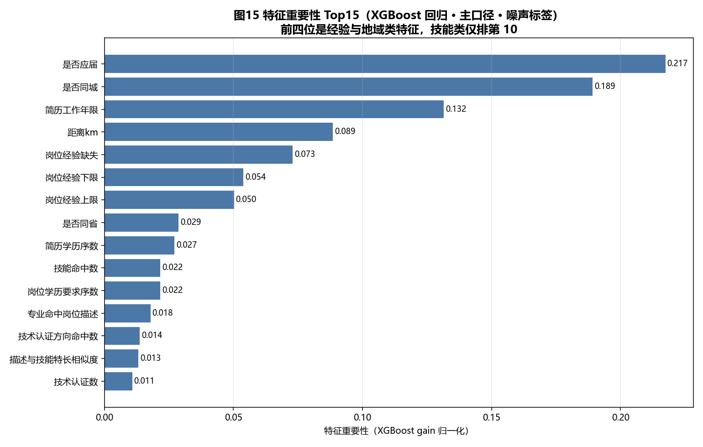

**① 现象**：前四位是 **是否应届 0.217 / 是否同城 0.189 / 简历工作年限 0.132 / 距离km 0.089**；"岗位经验缺失"（A2 错位标记）排第 5（0.073）；**技能命中数只排第 10（0.022）**。

**② 业务含义**：决定匹配分的其实是**经验与地域这两类"硬条件"**，不是技能。原因有二：岗位技能标签质量差（"测试开发工程师"的标签竟是 `互感器|变压器|DFT`），且**合成简历只有 74 个技能词**，与真实岗位词表几乎不重叠。

**③ 对系统的启发**：这一条**推翻了图3 的旧判断**（详见 §四 第 2 条的更正）。产品上若要让技能说话，得先扩简历技能词表或引入技能同义词库。

#### 图16 分类 PR 曲线

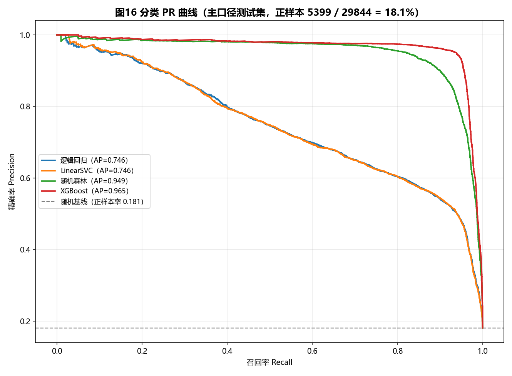

**① 现象**：主口径测试集（正样本 18.1%）上，XGBoost AP **0.965**、随机森林 0.949、逻辑回归 0.746、LinearSVC 0.746、随机基线 0.181。

**② 业务含义**：正样本只有 18%，**PR 曲线比 ROC 更能反映实际体验**；曲线前段（Recall 0.3 以内）的精确率都接近 1.0，说明**推荐列表前几名几乎不会推错**。

**③ 对系统的启发**：产品首页给 5–10 个推荐位最合适（P@10 = 0.671）；要覆盖更多正样本就得牺牲精确率（R@10 仅 0.525）。

---

## 四、跨图综合结论

1. **产业结构**：本批岗位是"**制造业质量/生产 + IT 开发/测试/运维**"双主线（图3、图7 互相印证）；薪资集中在 **5-15 千**（图1），经验要求集中在 **1-5 年**（图2）。
2. **三维硬门槛**：**地域（图8/9）→ 学历（图4）→ 经验（图2）**构成筛选链条，技能（图3）是门内最强的区分维度。**⚠ 2026-09-14 更正**：任务5 用真实简历数据实测后，该判断**不成立**——技能维度对匹配分的实际贡献只有约 **1.2/100 分**（合成简历仅 74 个技能词，与真实岗位标签重叠极低），真正主导标签的是**经验与地域**（见《评分模型文档》§8.2 与图15）。旧表述"4 条门槛 + 技能权重最高"作废，现行口径为**六维加权连续打分（技能 0.30 / 经验 0.20 / 学历 0.15 / 地域 0.15 / 薪资 0.12 / 专业证书 0.08），阈值 ≥65 判定匹配**。
3. **市场高度长尾**：4,096 家企业（图6）、6,037 种岗位名称（图7），必须先**归并**（岗位大类 / 技能词典 / 城市）再建模，否则特征维度不可控。
4. **地域边界明确**：仅东南沿海四省（图8），福建内部为福厦双核（图9），决定了系统的地理适用范围。
5. **经验-薪资非线性**：经验溢价在 5-10 年后加速（图5），说明"经验"既要作门槛也要进打分公式。
6. **薪资描述要用中位数**：中位数 7,671 元 / 平均数 8,392 元（差 9.4%），分布右偏；P25-P75 区间为 **6,006-10,000 元**（图11）。
7. **雇主响应度可作加分项**：360 家（≥5 岗）公司中头部活跃雇主得分 60~85（图10）；但 `今日回复数` 仅 52.3% 覆盖、`回复时效` 几乎全空，**"无数据"必须与"不活跃"区分**。

---

## 五、对后续任务的具体输入

| 后续任务 | 本报告给出的输入 |
|---|---|
| **任务6 人岗匹配** | ① **已落地权重**：技能 0.30、经验 0.20、学历 0.15、地域 0.15、薪资 0.12、专业证书 0.08（见《评分模型文档》§2.1）；② 不再用硬门槛，改为**六维加权连续打分（0–100）+ 阈值 ≥65 判定匹配**；③ 薪资用"岗位上限 vs 简历期望下限"比值、地域用距离分档（≤100km / 100–300km / >300km）；④ 雇主响应度（图10 口径）与公司规模作为特征入模，缺数据用哨兵 −1，不加减分 |
| **任务7 岗位聚类** | ① 特征：平均薪资、经验要求、学历序数、技能 Top-N one-hot、岗位大类；② 簇命名直接借用图7 的 18 个大类；③ PCA/t-SNE 出图时标注每簇高频技能（图3）；④ 薪资特征建议用**中位数**与分位数而非平均数（图11 显示分布右偏） |
| **任务10 RAG / Agent** | 把本报告结论做成结构化知识卡（薪资档与分位数、经验档、岗位大类、城市分布、热词 Top20、活跃雇主榜），问答时直接引用，降低幻觉 |
| **任务11 前端** | ① 地图（图8/9）嵌入城市选择页；② 词云（图3）与岗位分布（图7）做"市场概览"页；③ 经验-薪资曲线（图5）与薪资统计（图11）做"薪资预期"小组件；④ 图10 的活跃雇主榜可做"响应快的公司"标签 |

---

## 六、未覆盖的可视化方向及原因（如实说明）

| 方向 | 原因 |
|---|---|
| 按行业分层的薪资分布（箱线/小提琴图） | 数据未采集 `industry` 字段——智联招聘列表页/详情页未提供行业字段（见《需求分析文档》§5.3 字段差异说明），无法按行业分层 |
| 福利标签出现频率图 | 福利信息杂糅在 `技能标签` 字段中，并非独立字段；且按用户要求已把福利类词从技能词云中剔除，故不单独出频率图 |
| 城市 × 岗位大类热力图 | 数据支持（图7 大类 × 图9 城市可交叉），列为可选扩展；当前 9 张图已满足课程"≥6 张"要求 |
| 简历侧可视化 | 简历数据（500 份）统计已单独产出（`data/processed/简历数据统计.md` + 分布明细 CSV），属任务3/6 范畴，本报告不重复 |

---

## 七、图表与数据文件清单

| 文件 | 说明 |
|---|---|
| `reports/figures/01_岗位薪资水平对比_柱状图.{html,png,csv}` | 图1 + 薪资分档数据 |
| `reports/figures/02_经验要求结构分布_堆叠柱状图.{html,png,csv}` | 图2 + 经验×学历交叉数据 |
| `reports/figures/03_核心技能需求热度_词云.{html,png,csv}` | 图3 + 技能词 Top150 |
| `reports/figures/03_核心技能需求热度_词云_已剔除的非技能词.csv` | 词云剔除的 434 种非技能标签明细 |
| `reports/figures/04_学历要求门槛分析_饼状图.{html,png,csv}` | 图4 + 学历分布 |
| `reports/figures/05_经验薪资增长曲线_多折线图.{html,png,csv}` | 图5 + 6 城市 × 经验档薪资 |
| `reports/figures/06_招聘活跃企业TOP榜_横向柱状图.{html,png,csv}` | 图6 + 企业 TOP20 |
| `reports/figures/07_岗位分布_横向柱状图.{html,png,csv}` | 图7 + 18 个岗位大类分布与高频岗位 |
| `reports/figures/中国地图_岗位数量分布.{html,png}`、`中国各省岗位数量.csv` | 图8 + 各省岗位数（HTML 可交互，PNG 用于报告嵌入） |
| `reports/figures/福建省地图_岗位数量分布.{html,png}`、`福建省各市岗位数量.csv` | 图9 + 福建各市岗位数（同上） |
| `reports/figures/10_回复积极企业TOP20_横向柱状图.{html,png,csv}` | 图10 + 公司回复积极度明细（覆盖率/活跃占比/平均回复/得分） |
| `reports/figures/11_薪资统计_直方图与分位数.{html,png,csv}` | 图11 + 统计量（最小/P10/P25/中位数/平均/P75/P90/最大）+ 分箱与累计占比 |
| `reports/figures/12_模型对比_柱状图.png` | 图12（数据源 `data/processed/模型评估结果_回归.csv` / `_分类.csv`） |
| `reports/figures/13_预测vs真实_散点图.png` | 图13（XGBoost，主口径测试集） |
| `reports/figures/14_残差分布_直方图.png` | 图14（4 个回归模型残差） |
| `reports/figures/15_特征重要性Top15_横向柱状图.png` | 图15（数据源 `data/processed/模型特征重要性.csv`） |
| `reports/figures/16_分类PR曲线_折线图.png` | 图16（4 个分类模型 PR 曲线） |
| `docs/评分模型文档.md` | **任务5 评分模型文档**：标签口径、36 个特征、划分口径、全部指标、局限 |
| `reports/数据看板.html` | **数据看板**：11 张业务图/地图 + 逐图解释 + 交互版链接，`src/analysis/build_dashboard.py` 生成 |
| `src/analysis/job_charts.py`、`src/analysis/map_job_distribution.py` | 图表生成脚本（一键复现全部图） |

> 复现命令：
> ```bash
> python src/analysis/job_charts.py           # 生成图1~图7、图10、图11（HTML + PNG + CSV）
> python src/analysis/map_job_distribution.py # 生成图8、图9（HTML + CSV）
> python src/analysis/build_dashboard.py      # 生成数据看板 reports/数据看板.html
> python src/models/scoring/model_charts.py   # 生成图12~图16（模型评估图）
> ```

---

> 文档版本：v1.1（2026-09-10 更新：新增图10 回复积极企业 TOP20、图11 薪资统计，图表总数 9 → 11）｜ v1.0（2026-09-10 撰写完成，替换原占位版本）｜ 更新维护：`docs/可视化分析报告.md`
